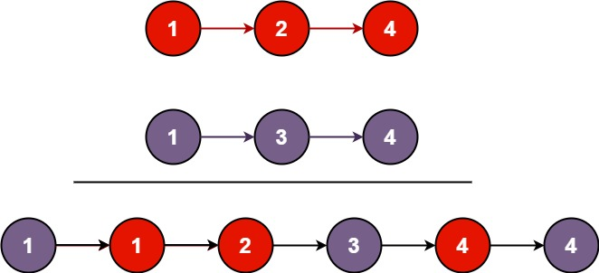

将两个升序链表合并为一个新的 升序 链表并返回。新链表是通过拼接给定的两个链表的所有节点组成的。  
示例 1：

输入：l1 = [1,2,4], l2 = [1,3,4]
输出：[1,1,2,3,4,4]

```
# Definition for singly-linked list.
# class ListNode(object):
#     def __init__(self, val=0, next=None):
#         self.val = val
#         self.next = next
class Solution(object):
    def mergeTwoLists(self, list1, list2):
        """
        :type list1: Optional[ListNode]
        :type list2: Optional[ListNode]
        :rtype: Optional[ListNode]
        """
        if list1 is None:
            return list2
        if list2 == None:
            return list1

        head = ListNode()
        cur = head
        while list1 is not None and list2 is not None:
            if list1.val > list2.val:
                cur.next = list2
                cur = cur.next
                list2 = list2.next
            else:
                cur.next = list1
                cur = cur.next
                list1 = list1.next

        if list1 is None:
            cur.next = list2
        if list2 is None:
            cur.next = list1
        return head.next

```
